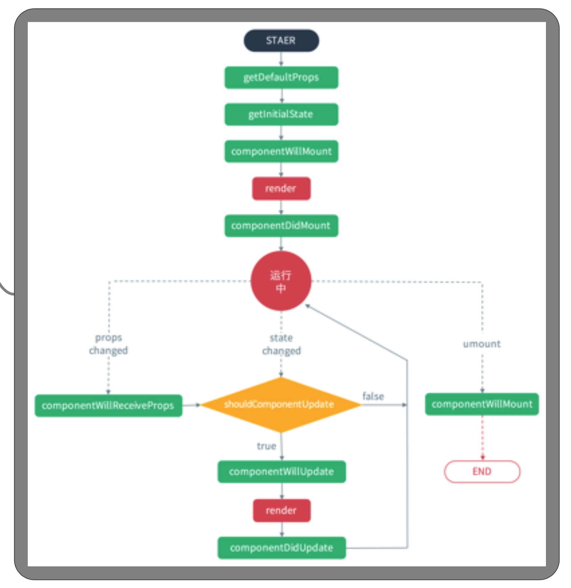

# 注意事项

## 表单
* 跟 jquery 方式一样，拿到dom,修改input的值

```
    <input type="text" ref="username"/>

    //获取input的值，this.refs.username.value
```

* 更改state状态来修改input的值（推荐）

```
    constructor(props){
        super(props)
        this.state = {
            username : ''
        }
    }
    <input type="text" ref={this.state.username}/>
```

## 生命周期


