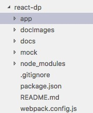
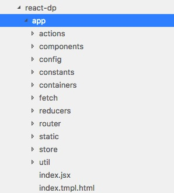

# 目录结构

## app：项目文件夹

* action：定义一些行为，redux中 action，比如：用户信息的更新（update），收藏和取消收藏（add和rm）
* reducers：action 只是用来定义行为，实际的处理逻辑在 reducers 中
* store：把 reducers 丢进去，创建 store，store 里面存放的是全部的 action
* constants：action和reducers 都会用到的一些变量，方便管理存在此处

* ============================================================================
* containers：页面，每个页面对应一个文件夹，用来处理逻辑（接收和发送 ajax 请求等），并把相关的数据传给components组件
* components：组件，只用来接受数据，显示dom结构，与逻辑无关，传给我怎样的数据就显示成怎样
* fetch：每个页面对应一个文件夹，和 ajax 请求相关，这里对fetch 中的 get 和 post 封装成2个文件，即 get.js 和 post.js
* ============================================================================

* static：一些静态文件，比如 css 和 fonts 等
* util：封装了localStorage的相关操作，getItem和 postItem
* configs：也是变量，存入localStorage的变量

## docs：md 文件

## mock：模拟数据，存放一些json 文件和一些服务（get 和 post，返回的值就是 json 文件），这里的目录于 fetch 文件夹中的目录一致

